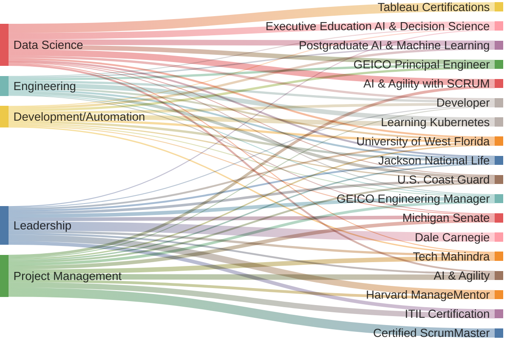
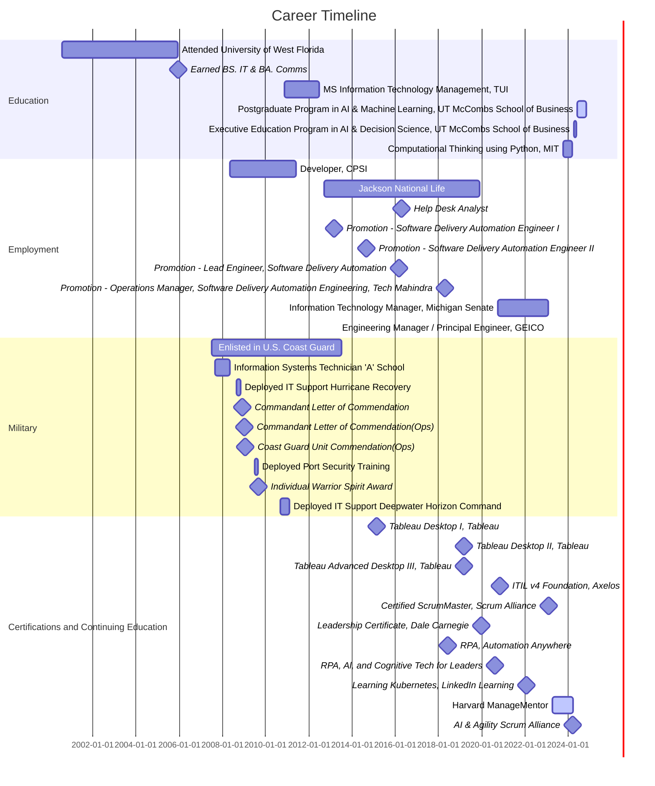

# Meet Angel Ennis
## My Professional Journey

### GEICO
- **Engineering Manager and Principal Engineer**
  - Developed automation solutions for Network Reliability Engineering.
  - Streamlined configuration management and compliance for network appliances.
  - Led cost-saving initiatives projected to save $40 million.
  - Fostered a culture of innovation and collaboration.

### Previous Role: Michigan Senate (2020-2023)
- **Information Technology Manager**
  - Managed and supervised IT activities and teams.
  - Implemented robust security procedures.
  - Led projects that significantly improved service efficiencies.

### Jackson National Life Insurance Company (2012-2019)
- **Roles**: Operations Manager, Lead Engineer, Software Delivery Automation Engineer
  - Successfully led numerous projects including software upgrades and system retirements.
  - Improved asset management and deployment processes.

### Education
- **University of West Florida**
  - Bachelor of Science in Information Technology
  - Bachelor of Arts in Communication Arts
- **University of Texas, McCombs School of Business**
  - Executive Education Program - Decision Science and AI
  - Graduate Certificate - Artificial Intelligence & Machine Learning: Business Applications

### Certifications
- **ITIL® Foundation Certificate in IT Service Management** (July 2022 - July 2025)
- **Certified ScrumMaster® (CSM)** (September 2023 - September 2025)
- **Tableau Software**
  - Tableau Desktop I & II: Accelerated (February 2019)
  - Tableau Desktop III: Advanced (March 2019)

### Awards
- **Military Honors**:
  - **Letters of Commendation** for outstanding performance during the 2008 Hurricane Season and Hurricane IKE response.
  - Recognized for exceptional service and leadership in multiple critical situations.

## Participation in Recruiting Activities at University of Michigan for GEICO Tech

During my tenure at GEICO, I actively engaged in recruiting activities at the University of Michigan to attract top talent to GEICO Tech. I participated in several events, demonstrating GEICO's commitment to fostering diversity and excellence in engineering.

One of the notable events was my participation as a speaker at a lunch organized by the Women in Engineering student organization. During this event, I shared insights about my career journey, the importance of diversity in tech, and the innovative projects at GEICO Tech. I provided mentorship and guidance to aspiring female engineers, encouraging them to pursue careers in technology and highlighting the opportunities available at GEICO.

In addition to speaking engagements, I attended career fairs and networking events, engaging with students, answering their questions, and providing information about GEICO's internships and job opportunities. My involvement in these activities helped strengthen GEICO's presence at the University of Michigan and contributed to building a pipeline of talented and diverse candidates for the company.

## My CV
### GEICO (Feb 2023 - Present)
- **Role**: Engineering Manager / Principal Engineer
  - Developed automation for Network Reliability Engineering Configuration Management, streamlining configuration management and compliance for network appliances.
  - Led an initiative projected to save $40M by internalizing incident response and change management, transitioning from MSP to automation frameworks.
  - Orchestrated the migration of network automations to production, boosting operational efficiencies for quarterly maintenance tasks.
  - Streamlined DNS testing using Python, significantly reducing implementation and testing time.
  - Fostered a culture of innovation and collaboration, aligning the team with Agile methodologies and ITIL practices, and championing inclusivity and equitable compensation.
  - Developed a learning hub for NetDevOps training.
  - Actively engaged in recruiting activities at the University of Michigan for GEICO Tech, including speaking at a Women in Engineering student organization event, mentoring aspiring female engineers, and participating in career fairs and networking events to attract top talent and strengthen GEICO's presence on campus.

### Michigan Senate (2020-2023)
- **Role**: Information Technology Manager
  - **Coordinated and Oversaw IT Activities**
    - Managed and supervised a team of System Development Analysts and IT Specialist staff.
    - Directed the planning and implementation of computer-related activities, ensuring alignment with the Senate’s information systems requirements.
  - **Technology Needs Assessment and Implementation**
    - Assisted the Director of Senate Business Office (SBO) in determining the technology needs of the Michigan Senate.
    - Implemented computer systems to fulfill the Senate’s information systems requirements, enhancing overall efficiency and effectiveness.
  - **Security Procedures Development**
    - Developed and implemented robust security procedures, ensuring the protection of the Senate’s information systems.
    - Led special projects that improved service and efficiencies within the organization.
  - **Leadership and Team Management**
    - Supervised a small team of System Development and IT Specialist personnel, providing mentorship, feedback, and prioritization of workflow.
    - Ensured that deadlines were met and that the work product was valuable and met high service levels.
  - **Cross-Departmental Coordination**
    - Coordinated with SBO departmental supervisors, Senate Leadership, and other Senate Offices to provide recommendations regarding department-wide initiatives.
    - Worked collaboratively with both partisan offices and nonpartisan departments to lead special projects.
  - **Problem Solving and Innovation**
    - Developed a systematic approach to analyze and solve problems, anticipating risks and mitigating them proactively.
    - Recommended new technologies and methods to improve service and efficiencies within the organization.
  - **Project Management and Evaluation**
    - Participated in the evaluation, testing, and recommendation of new software packages and computer hardware configurations.
    - Prepared project budgets, assessed technical skill levels and resources needed on projects, and provided support and direction for resolving technical or organizational issues.
  - **Policy Development and Best Practices**
    - Developed and implemented IT policies and best practice guides for the Senate in conjunction with the Director of SBO.
    - Created metrics to monitor software development and quality assurance, ensuring continuous improvement.
  - **Special Projects and Reporting**
    - Led and participated in special projects as assigned by the Director of SBO.
    - Submitted biweekly status reports to the Director of SBO, producing progress reports on activities performed and planned for the upcoming weeks.

### Jackson National Life Insurance Company (Various Roles 2012-2019)

#### 2019 (Tech Mahindra: Supporting Jackson National Life)
- **Role**: Operations Manager, Software Delivery Automation Engineering
  - Continued to lead and implement successful projects, including software upgrades and process improvements.
  - Developed a release methodology process, significantly enhancing cross-departmental communication and coordination.
  - Organized and executed various IT initiatives, ensuring smooth transitions and reduced risks.

#### 2018
- **Role**: Lead Engineer, Software Delivery Automation
  - Led the team through growth, providing options for replacing outdated software and stabilizing platforms.
  - Facilitated the retirement of the legacy Windows Server 2003 Citrix platform and provided packages for updates and new releases.
  - Created over 500 documentation pieces, standardized templates, and improved communication and process clarity across departments.
  - Served on the Events and Awards committee.
  - Participated as a panel member at the 2018 High School Expo, sharing professional experiences and engaging with students.

#### 2017
- **Role**: Lead Engineer, Software Delivery Automation
  - Led a team that reduced risk through the elimination of outdated software and improved service through continued adoption of Aternity.
  - Served on the Customer Advisory Board for Aternity.
  - Successfully navigated departmental priority shifts and ensured team adaptability and performance.
  - Improved communication and release strategy through the setup of infrastructure on Confluence.

#### 2016
- **Role**: Lead Engineer, Software Delivery Automation
  - Continued to lead and organize team projects, including software upgrades and process improvements.
  - Promoted productivity, organization, and communication within the department.

#### 2015
- **Role**: Software Delivery Automation Engineer II
  - Promoted to Team Lead in recognition of performance and leadership abilities.
  - Played a vital role in the success of the IE11 project and Citrix retirement, ensuring smooth transitions and

 reduced risks.
  - Organized and executed the Microsoft Office rollout and transferred responsibility of OS and application delivery to on-site support.

#### 2014
- **Role**: Software Delivery Automation Engineer I
  - Promoted to Software Administrator II in recognition of performance and ability to take on additional leadership responsibilities.
  - Successfully implemented BMC FootPrints software, improving the company's asset management and deployment processes.
  - Contributed to reducing the number of outstanding security patches to zero on all client systems.
  - Ensured the timely delivery of Microsoft Office upgrades, addressing associate issues effectively.

#### 2013
- **Role**: Software Administrator I
  - Made an immediate impact by providing excellent customer service and maintaining a positive attitude.
  - Successfully handled thousands of tickets for Jackson associates in a timely and positive manner.
  - Created knowledge documents and helped improve communications, leading to a system of cross-training within the team.

#### 2012
- **Role**: Help Desk Analyst
  - Mastered new job responsibilities faster than any analyst hired within the Service Desk all year.
  - Promoted to a higher-level position within three months.
  - Maintained an after-call wait time average of less than two minutes.
  - Created/updated an average of two knowledge base articles per month.
  - Consistently exceeded expectations in adaptability, communication, job-specific skills, multitasking, interpersonal skills, problem-solving, customer service orientation, and execution of work.

### Education

- **University of West Florida**
  - Bachelor of Science in Information Technology
  - Bachelor of Arts in Communication Arts

- **University of Texas, McCombs School of Business**
  - Executive Education Program - Decision Science and AI
  - Graduate Certificate - Artificial Intelligence & Machine Learning: Business Applications

### Certifications

- **ITIL® Foundation Certificate in IT Service Management** (July 2022)
  - Certified by AXELOS, valid until July 2025

- **Certified ScrumMaster® (CSM)** (September 2023)
  - Certified by Scrum Alliance®, valid until September 2025

- **Tableau Software**
  - Tableau Desktop I & II: Accelerated (February 2019)
  - Tableau Desktop III: Advanced (March 2019)

- **Massachusetts Institute of Technology (MIT)**
  - Computational Thinking using Python

### Harvard ManageMentor® Courses (March 2024)
- Diversity, Inclusion, and Belonging
- Attracting and Cultivating Talent
- Strategy Planning and Execution
- Difficult Interactions
- Performance Appraisal
- Global Collaboration
- Leveraging Your Networks
- Feedback Essentials
- Developing Employees
- Presentation Skills
- Ethics at Work
- Persuading Others
- Managing Your Boss
- Meeting Management
- Writing Skills
- Career Management
- Leading People
- Stress Management
- Team Management
- Time Management
- Coaching

### Awards

- **Military Honors**:
  - **Letter of Commendation (January 8, 2009)**: Recognized for outstanding performance during the 2008 Hurricane Season, providing 24/7 electronics and computer support during three major hurricanes, two significant tropical storms, and a Level II Incident Command System (ICS) event.
  - **Letter of Commendation (December 31, 2008)**: Acknowledged for exceptional performance of duty while serving as a Network Administrator during Hurricane IKE response and recovery operations, ensuring successful mitigation of numerous incidents and facilitating safe return of displaced residents.
