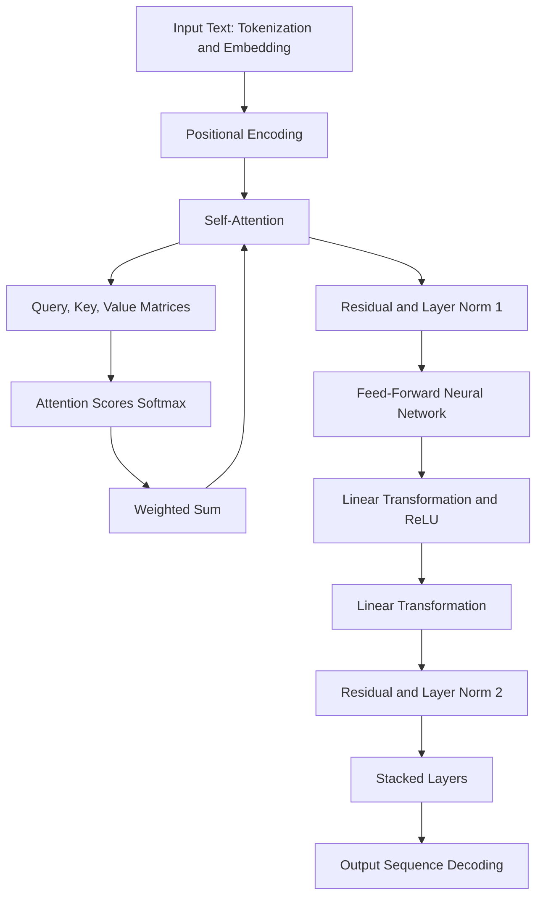

# The Inner Workings of Transformer Layers #

### 1. Input Representation
Transformers begin by converting input data (e.g., text) into numerical representations. This involves two main steps:
- **Tokenization**: Splitting the text into smaller units (tokens).
- **Embedding**: Converting tokens into dense vectors using an embedding matrix.

### 2. Positional Encoding
Since transformers don't inherently understand the order of sequences (like text), they add positional encodings to the embeddings to introduce information about the positions of tokens in the sequence.

### 3. Transformer Layer
The core of the transformer model consists of multiple layers, each comprising two main components:
- **Multi-Head Self-Attention**: Allows the model to focus on different parts of the input sequence simultaneously.
- **Feed-Forward Neural Network**: Applies a series of linear transformations and nonlinear activations to the input.

#### 3.1 Multi-Head Self-Attention
- **Scaled Dot-Product Attention**: This is the core of self-attention, which involves three main steps:
  1. **Query, Key, Value (QKV) Matrices**: The input embeddings are linearly transformed into three different matrices: Queries (Q), Keys (K), and Values (V).
  2. **Attention Scores**: Compute attention scores by taking the dot product of the Query matrix with the Key matrix and then scaling by the square root of the dimension of the keys. These scores are passed through a softmax function to obtain attention weights.
  3. **Weighted Sum**: The attention weights are used to compute a weighted sum of the Values, resulting in the attention output.
- **Multi-Head Mechanism**: This process is done multiple times in parallel (heads), allowing the model to focus on different parts of the input sequence. The outputs from each head are concatenated and linearly transformed.

#### 3.2 Feed-Forward Neural Network
- This component consists of two linear transformations with a ReLU activation in between. It is applied to each position independently and identically:
  1. **Linear Transformation**: The input is linearly transformed to a higher-dimensional space.
  2. **ReLU Activation**: Non-linear activation function applied to introduce non-linearity.
  3. **Linear Transformation**: Another linear transformation is applied to project back to the original dimension.

### 4. Residual Connections and Layer Normalization
Each sub-layer (self-attention and feed-forward) in the transformer layer has a residual connection followed by layer normalization. This helps in stabilizing the training and allows the model to learn more effectively:
- **Residual Connection**: Adds the input of the sub-layer to its output.
- **Layer Normalization**: Normalizes the summed output to have zero mean and unit variance.

### 5. Stacking Layers
Transformers typically consist of several such layers stacked on top of each other. Each layer refines the representations learned by the previous layer.

### 6. Output Layer
- **Decoding**: For tasks like language modeling or translation, a decoding mechanism (which can also be a stack of transformer layers) generates the final output sequence.

### Training
During training, the model updates its internal weights (parameters) by minimizing a loss function using optimization algorithms like Adam. The loss function measures the difference between the model's predictions and the actual targets. Backpropagation is used to compute the gradients of the loss with respect to the model's parameters, and these gradients are used to update the parameters.

### Summary
Transformers extract meaning from data through a series of self-attention mechanisms and feed-forward networks, which allow them to process and refine representations of the input data across multiple layers. The combination of these components enables the model to capture complex relationships and patterns in the data, ultimately producing meaningful output.

